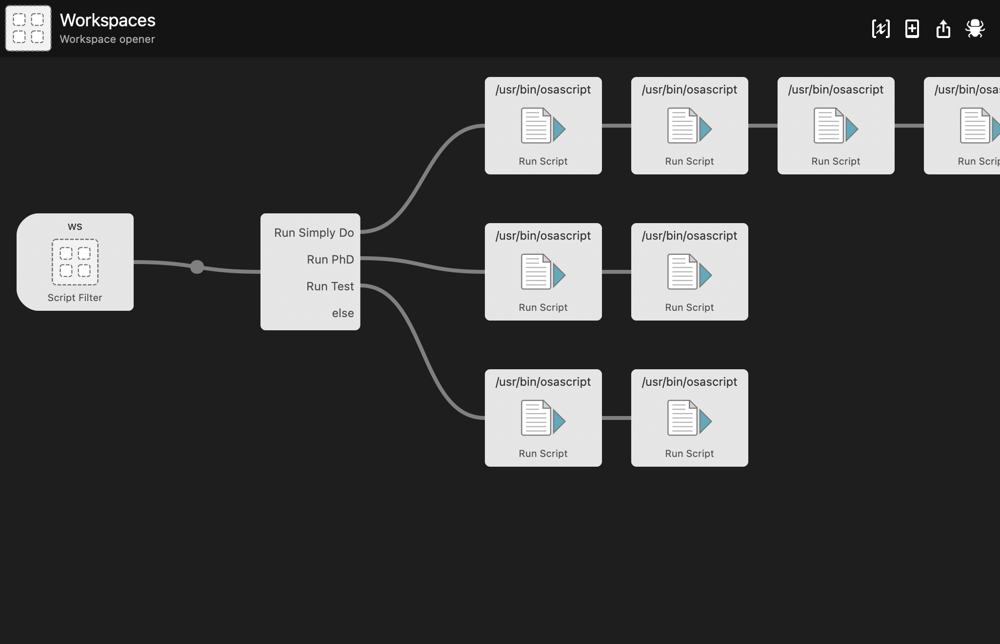

# Alfred workspace manager

Creates alfred workflows to build and tear down window configurations

## Instructions

Modify `spaces` folder as needed, then run `install.py`

Currently no capability to load an initial config, so to modify input word navigate to `construct/filtering` and modify `FilterConfig.keyword` default param directly.